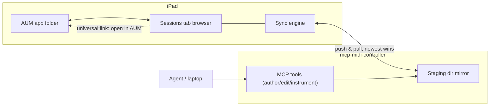

# AUM sessions tab — unified browser + automated sync

The concept for the redesigned AUM-sessions tab (job 2 of
[design.md](design.md)). Today the tab is two file lists with a manual ferry:
the linked AUM folder on one side, the files staged on
[mcp-midi-controller](https://github.com/teemow/mcp-midi-controller) on the
other, and per-row upload/download buttons in between. The redesign makes it
**one folder browser over a single logical session library**. The iPad's linked
AUM folder and the controller's staging dir become two replicas of that
library, kept identical by an automatic sync engine. The UI shows each file
once, with a per-file sync badge instead of upload/download buttons.

> Public-repo rule: as everywhere in this repo, the doc and the feature carry no
> installation-specific data. Session titles/filenames are private rig data —
> shown in-UI, never logged or committed. Pinned folders are user settings
> (UserDefaults), not hardcodes.

## Use cases

1. **Session launcher (primary live/rehearsal use).** Browse folders, tap a
   session, it opens in AUM via the universal link. A pinned band folder makes
   this a one-or-two-tap set-list browser.
2. **Agent authoring loop.** The agent generates a new session via
   `author_aum_session` into the staging dir; the sync engine pulls it onto the
   iPad automatically; it appears in the browser with a "new" badge; one tap
   loads it into AUM. No manual download step.
3. **Agent iteration on an existing session.** The agent edits a staged copy
   (`edit_aum_session`); auto-pull overwrites the device file; if that session
   is currently loaded the row offers "reload in AUM" (writing the file does
   not hot-reload AUM).
4. **Bulk structure migration.** The agent rewrites every session (e.g. a new
   standard MIDI mapping via `instrument_aum_session` / `export_aum_midimap`);
   all updates flow back automatically; the browser shows which files changed.
5. **Keeping the MCP tools truthful.** The push direction guarantees
   `list/get/diff_aum_session` on the laptop always operate on the current
   on-device state — the agent never reasons about stale files.
6. **Inspect without AUM.** Tap-to-inspect (the on-device parser) stays: verify
   channels, nodes, and mappings of any session or midimap without loading it.
7. **Implicit backup.** Because the staging dir is a full mirror, the
   controller always holds a current copy of every AUM session — restore or
   migrate by syncing to a fresh iPad.
8. **Library hygiene.** Browse by folder, see per-folder counts, delete staged
   orphans; destructive actions stay explicit and controller-side only (the app
   still never deletes a file inside the AUM folder).

## UI structure

- **Header**: tab title + a one-line sync state ("synced · 134 files · 8:24" /
  "pulling 3…" / "controller offline — browsing device copy"). The one-off
  "open file" inspect stays.
- **Folder browser** replaces the flat list + filter chips (the
  `subfolderFilterBar` in
  [AUMSessionsView.swift](../Sources/AUv3ProbeApp/AUMSessionsView.swift)):
  `NavigationStack` drill-down through real subfolders, folder rows with file
  counts and "changed" dots, file rows with kind/size/date + sync badge.
- **Pinned folder + recents**: pin any folder to the top of the root view
  (UserDefaults); the browser reopens at the last visited folder. The band
  folder is a pin, not a hardcode.
- **Inbox strip**: files that arrived or changed from the controller since last
  viewed (tracked by the sync index) shown at the top of root; tap = open in
  AUM, dismiss per item or all at once.
- **File row badges**: `synced` (default, subtle), `pushing`/`pulling`
  (spinner), `new from controller`, `conflict` (both sides changed — the row
  expands to "keep device / keep controller"), `error`.
- **Controller card** shrinks to a footer: host, staged count, "clear staging"
  with the existing confirmation.
- Unlinked-folder and no-host states keep today's onboarding copy.

## Sync model

- **Index-based mirror, newest wins.** The app persists a sync index
  (relative path → mtime, size, last-synced rev). Each cycle: enumerate the
  device folder, fetch the controller manifest, diff against the index. One
  side changed → copy to the other; both changed → conflict badge (no silent
  overwrite); deletions do **not** propagate in v1 (explicit delete actions
  remain).
- **Triggers**: daemon becomes reachable, app foreground, tab appears, and a
  lightweight poll while foregrounded. This replaces the current once-per-host
  `autoSync` in
  [AUMSessionsModel.swift](../Sources/AUv3ProbeApp/AUMSessionsModel.swift),
  which only pushes (device → controller) and only once per discovered host.
- **Cheap change detection**: the controller adds a monotonic `rev` to the
  `GET /aum-session` manifest, bumped on every stage/author/edit/delete via the
  existing `onStaged` hook path in the controller's
  `internal/aumreceiver/receiver.go`; the app polls with the last seen rev and
  skips all diffing work when unchanged.
- **iOS constraint**: sync runs only while the app is foregrounded — stated
  plainly in the UI ("last synced …") instead of pretending otherwise.

As today, files move as **verbatim bytes** in both directions: the sync engine
copies, it never re-encodes (the app has no writer for the `NSKeyedArchiver`
format; the on-device parser is read-only, for inspect).

## Implementation

### mcp-midi-controller (small)

- Add the manifest `rev` (and bump it on MCP-tool writes to the staging dir,
  not just receiver uploads).
- Ensure authored/edited files land in the staging tree with sensible subfolder
  placement (the agent can target a specific subfolder).

### auv3-probe

- New `AUMSyncEngine`: owns index persistence, diffing, the push/pull loop, and
  per-file `SyncState`. `AUMSessionsModel` slims down to inspect/open/delete
  actions.
- Rework `AUMSessionsView`: folder browser navigation, pinned folder, inbox
  strip, sync badges; remove the duplicate controller list and the per-row
  upload buttons.
- Keep: the on-device inspector and the share-sheet fallback when no folder is
  linked. The old `pushAndOpen` becomes a pure universal-link open (the sync
  engine guarantees the device copy is current, so no bytes move on tap), and
  conflicts resolve inline on the row ("keep device / keep controller") —
  the destination picker goes away entirely.

## Order of work

Concept doc (this file) first, then the controller `rev`, then the sync engine,
then the UI rework — each step ships independently behind the existing tab.
