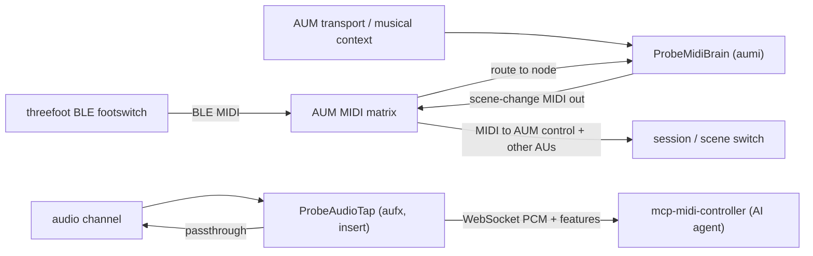

# Running inside AUM — the AUv3 extensions (job 3)

This is the design of **job 3** from [design.md](design.md): `auv3-probe` shipping
two AUv3 **app extensions** so the app lives *inside* the AUM host process, not
just beside it.

- **ProbeMidiBrain** (`aumi`, a MIDI processor) — lives in an AUM **MIDI strip**.
  It receives MIDI (the "threefoot" BLE footswitch, routed in by AUM) and, knowing
  the **song structure**, emits **scene-change MIDI** out — driven by the host
  transport position and by footswitch input. AUM is fully MIDI-controllable and
  can load a full session from a single MIDI message, so MIDI-out is the lever for
  scene changes.
- **ProbeAudioTap** (`aufx`, an audio effect) — inserted in an AUM **audio
  channel**. A transparent passthrough that also taps the buffer and streams
  downsampled mono PCM + RMS/peak features over the LAN to `mcp-midi-controller`,
  giving an AI agent **"ears"** on the rig — the unique feedback loop.

Both reuse the shared **signalwave** UI and ProbeKit. The container app keeps its
existing jobs (read audio units, ferry AUM sessions).

## Why app extensions (and which kind)

An AUv3 with a UI is a **classic `NSExtension`** (`NSExtensionPointIdentifier =
com.apple.AudioUnit-UI`) — *not* an ExtensionKit extension. The host loads the
extension, instantiates its `NSExtensionPrincipalClass` (an `AUViewController`
that also conforms to `AUAudioUnitFactory`), asks it to create the `AUAudioUnit`,
and presents its view.

AU **type** choice (confirmed against AUM's behaviour):

| Extension | Type | Lives in | Receives MIDI | Taps audio | Emits MIDI |
|---|---|---|---|---|---|
| ProbeMidiBrain | `aumi` MIDI processor | MIDI strip | yes (render event list) | no | yes (`MIDIOutputEventBlock`) |
| ProbeAudioTap | `aufx` effect | audio channel insert | no (not needed) | yes (render buffer) | no |

MIDI-out works on any AU via `midiOutputNames` + caching `midiOutputEventBlock`
in `allocateRenderResources` and calling it from the render block. Transport /
musical position come from `transportStateBlock` + `musicalContextBlock`.

## Routing in AUM



### AUM recipes

**Footswitch → scene change (ProbeMidiBrain).**

1. Add a **MIDI strip** in AUM and insert **ProbeMidiBrain** on it.
2. In AUM's MIDI matrix, route the **threefoot** (BLE MIDI source) **into** the
   ProbeMidiBrain node.
3. Route **ProbeMidiBrain's MIDI output** to AUM's own **MIDI control** target
   (and/or to other plugin nodes that recall presets).
4. In the ProbeMidiBrain UI, add a **footswitch mapping** (e.g. CC 64 → `next`)
   and choose the scene-change encoding (Program Change or CC).
5. Press the pedal → the brain emits the mapped scene-change MIDI → AUM (or the
   downstream AU) switches scene/session.

**Transport → automatic section changes (ProbeMidiBrain).**

1. Author **song sections** in the ProbeMidiBrain UI, each pinned to an absolute
   **beat** position with a target **scene** index.
2. Start the AUM transport. As the playhead crosses each section boundary, the
   brain emits the section's scene-change MIDI exactly once.

**Audio tap → agent ears (ProbeAudioTap).**

1. Insert **ProbeAudioTap** as an effect on the audio channel you want to monitor
   (it passes audio through unchanged).
2. In its UI, enter the `mcp-midi-controller host:port` and press **start
   streaming**. It connects a WebSocket to `ws://host/audio-stream` and streams
   decimated mono PCM + RMS/peak.

## Project structure (four targets, two build paths)

SwiftPM (and thus xtool) needs one directory per target, so `Sources/` is split:

| Target | Dir | Role |
|---|---|---|
| `ProbeKit` | `Sources/ProbeKit/` | Shared library: signalwave `Theme`, `Receiver` + `DaemonClient` (LAN), data contracts (`AudioUnitDetails`, `AUMSessionModels`), FourCC helpers, and realtime AUv3 helpers (`RealtimeRing`, `MIDISupport`, `SongStructure`). |
| `AUv3ProbeApp` | `Sources/AUv3ProbeApp/` | The container app (`@main`) — jobs 1 + 2 UI/models, the on-device AUM-session parser. Depends on `ProbeKit`. |
| `ProbeMidiBrain` | `Sources/ProbeMidiBrain/` | The `aumi` extension: `AUAudioUnit` (`BrainEngine` realtime core) + `AUViewController`/factory + SwiftUI authoring UI. |
| `ProbeAudioTap` | `Sources/ProbeAudioTap/` | The `aufx` extension: `AUAudioUnit` (`TapDSP` realtime core) + `TapStreamer` (network) + `AUViewController`/factory + SwiftUI control UI. |

Both extensions pin **stable ObjC class names** (`@objc(...)` on the factory /
view controller) so the `Info.plist` `NSExtensionPrincipalClass` resolves under
SwiftPM's `Module.Class` mangling.

Build wiring:

- [Package.swift](../Package.swift): four targets; products = the app library +
  two extension `.library`s; `ProbeKit` depends on `swift-atomics`.
- [xtool.yml](../xtool.yml): `product: AUv3ProbeApp` + an `extensions:` entry per
  AU (`product` + `bundleID` + `infoPath` + `entitlementsPath`). xtool packs each
  into `PlugIns/<name>.appex`.
- [project.yml](../project.yml): a `ProbeKit` framework target, an `application`
  target embedding the two `app-extension` targets, and the swift-atomics package.
  The extension `NSExtension`/`AudioComponents` plists are generated from each
  target's `info.properties`.
- [Extensions/](../Extensions): the literal extension `Info.plist`s used by the
  **xtool** path (xtool does not resolve XcodeGen `$(...)` substitutions, so it
  reads these directly; XcodeGen generates its own from `project.yml`).

### AudioComponent identity (FourCC)

| | manufacturer | type | subtype |
|---|---|---|---|
| ProbeMidiBrain | `Tmow` | `aumi` | `pbMi` |
| ProbeAudioTap | `Tmow` | `aufx` | `pbAu` |

`sandboxSafe = true`; each appex bundle id nests under the app's
(`com.teemow.auv3probe.MidiBrain` / `.AudioTap`) — Apple requires appex ids to be
prefixed by the host app id.

## Realtime-safety model

The render block runs on a realtime audio thread: **no allocation, no locks, no
blocking**. The two cores follow the same discipline:

- **ProbeMidiBrain / `BrainEngine`.** The authored `BrainProgram` is published as
  a pre-sorted `RenderProgram` (no per-cycle sorting). The render thread snapshots
  it through `OSAllocatedUnfairLock.withLockIfAvailable` — a **non-blocking
  try-lock**; if the UI thread is mid-edit, the render simply skips that cycle
  (harmless for MIDI, never blocks audio). The snapshot copies only array
  *references* (a retain), not elements. Status the UI reads back (current
  section, last scene, transport) lives in `Atomics`, so the UI never touches the
  realtime lock. MIDI in is parsed from the render event list; MIDI out goes
  through the cached `midiOutputEventBlock`.
- **ProbeAudioTap / `TapDSP`.** The render block pulls input straight into the
  output buffers (zero-copy passthrough), computes block peak/RMS, and pushes
  decimated mono samples into a **lock-free SPSC ring** (`RealtimeRing`, backed by
  `swift-atomics` with acquire/release ordering). The `TapStreamer` networking
  thread is the single consumer. If the ring is full (the network fell behind) the
  overflow is **dropped** — a stalled tap must never glitch audio.

This is the plan's MVP: *"preallocated buffers + atomics; drop to a small C core
only if profiling shows glitches."*

## Audio-stream protocol (the wire contract)

ProbeAudioTap → `ws://<host>/audio-stream` (the host's `http`/`https` is mapped to
`ws`/`wss` by `DaemonClient.webSocketURL(path:)`). The **receiver** side lives in
the `mcp-midi-controller` repo; this repo defines and produces the contract:

1. **On connect — one TEXT (JSON) format message:**

   ```json
   { "type": "format", "encoding": "f32le", "channels": 1,
     "sampleRate": 11025.0, "source": "ProbeAudioTap" }
   ```

   `sampleRate` is the **decimated** rate (host rate ÷ decimation).
2. **Audio — BINARY messages:** little-endian `Float32` mono PCM, decimated, in
   chunks (no per-chunk header; the format message fixes the layout).
3. **Features — ~10 Hz TEXT (JSON) messages:**

   ```json
   { "type": "features", "rms": 0.0123, "peak": 0.0456 }
   ```

The MVP is intentionally small (mono PCM + RMS/peak) and extensible to richer
features later.

## State persistence (`fullState`)

Neither extension uses App Groups (which are fragile under free-Apple-ID / xtool
signing). Instead each AU persists its config inside the **AUM session**, per
node, via AUv3 `fullState`:

- ProbeMidiBrain stores the `BrainProgram` (song sections + footswitch map +
  output encoding) under `probeMidiBrainProgram`.
- ProbeAudioTap stores its `TapConfig` (stream host, streaming flag, decimation)
  under `probeAudioTapConfig`. The host is installation-specific and lives only
  on-device inside the session — never committed (public-repo rule).

Optional later enhancement: an **App Group** so the container app's authoring tab
can pre-seed an extension's config. Deferred — `fullState` is sufficient and
avoids the entitlement.

## Building

Same two paths as the rest of the repo:

- **Linux / xtool:** `make xtool-build` cross-compiles the app **and both
  extensions** in one shot; `make deploy` signs/installs over USB. The packed
  bundle has `PlugIns/ProbeMidiBrain.appex` + `PlugIns/ProbeAudioTap.appex`, each
  with the merged `NSExtension`/`AudioComponents` registration.
- **macOS / Xcode:** `make generate && make build` (XcodeGen → xcodebuild).
  Building the `AUv3Probe` scheme compiles ProbeKit + both embedded extensions.

> **Free-signing note.** Each appex adds a bundle id under xtool's `XTL-…` prefix.
> The 7-day development certificate and multi-bundle provisioning may need
> re-running `make deploy`. See [building-on-linux.md](building-on-linux.md).

## Status / limitations

- The code compiles and packs correctly on the xtool path (app + both appex with
  correct AudioComponent registration). **On-device discovery/loadability in AUM**
  is the remaining manual verification (`make deploy` to a trusted device, then
  insert the units in AUM).
- The audio-stream **receiver** is out of scope for this repo beyond the contract
  above; it is implemented in `mcp-midi-controller`.
