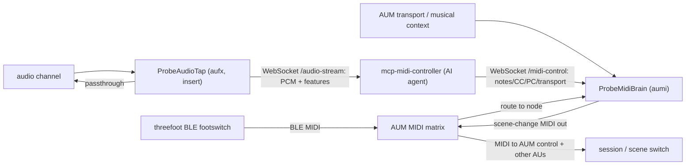

# Running inside AUM — the AUv3 extensions (job 3)

This is the design of **job 3** from [design.md](design.md): `auv3-probe` shipping
two AUv3 **app extensions** so the app lives *inside* the AUM host process, not
just beside it.

- **ProbeMidiBrain** (`aumi`, a MIDI processor) — lives in an AUM **MIDI strip**.
  It receives MIDI (the "threefoot" BLE footswitch, routed in by AUM) and, knowing
  the **song structure**, emits **scene-change MIDI** out — driven by the host
  transport position and by footswitch input. Hosted inside AUM the brain can
  reach almost AUM's **entire** control surface over MIDI (transport, tempo,
  mixer, **any node parameter**, session load) — measured in
  [aum-control-surface.md](aum-control-surface.md) — but only what the loaded
  session has **mapped**, which is why a deep session model plus a **standard
  mapping** (the
  [mcp-midi-controller / aum-brain-control.md](https://github.com/teemow/mcp-midi-controller/blob/main/docs/aum-brain-control.md)
  vision) is what turns MIDI-out into a reliable lever for scene changes. It also
  opens a **LAN control channel** to `mcp-midi-controller`
  (`ws://host/midi-control`): the daemon pushes note/CC/PC/transport commands and
  the brain re-emits them through its MIDI out — giving an AI agent **"hands"** on
  the rig, the symmetric counterpart to the tap's "ears".
- **ProbeAudioTap** (`aufx`, an audio effect) — inserted in an AUM **audio
  channel**. A transparent passthrough that also taps the buffer and streams
  downsampled mono PCM + RMS/peak features over the LAN to `mcp-midi-controller`,
  giving an AI agent **"ears"** on the rig — the unique feedback loop.

Both reuse the shared **signalwave** UI and ProbeKit. The container app keeps its
existing jobs (read audio units, ferry AUM sessions).

## Why app extensions (and which kind)

An AUv3 with a UI is a **classic `NSExtension`** (`NSExtensionPointIdentifier =
com.apple.AudioUnit-UI`) — *not* an ExtensionKit extension. The host loads the
extension, instantiates its `NSExtensionPrincipalClass` (an `AUViewController`
that also conforms to `AUAudioUnitFactory`), asks it to create the `AUAudioUnit`,
and presents its view.

AU **type** choice (confirmed against AUM's behaviour):

| Extension | Type | Lives in | Receives MIDI | Taps audio | Emits MIDI |
|---|---|---|---|---|---|
| ProbeMidiBrain | `aumi` MIDI processor | MIDI strip | yes (render event list + LAN `/midi-control`) | no | yes (`MIDIOutputEventBlock`) |
| ProbeAudioTap | `aufx` effect | audio channel insert | no (not needed) | yes (render buffer) | no |

MIDI-out works on any AU via `midiOutputNames` + caching `midiOutputEventBlock`
in `allocateRenderResources` and calling it from the render block. Transport /
musical position come from `transportStateBlock` + `musicalContextBlock`.

## Routing in AUM



### AUM recipes

**Footswitch → scene change (ProbeMidiBrain).**

1. Add a **MIDI strip** in AUM and insert **ProbeMidiBrain** on it.
2. In AUM's MIDI matrix, route the **threefoot** (BLE MIDI source) **into** the
   ProbeMidiBrain node.
3. Route **ProbeMidiBrain's MIDI output** to AUM's own **MIDI control** target
   (and/or to other plugin nodes that recall presets).
4. In the ProbeMidiBrain UI, add a **footswitch mapping** (e.g. CC 64 → `next`)
   and choose the scene-change encoding (Program Change or CC).
5. Press the pedal → the brain emits the mapped scene-change MIDI → AUM (or the
   downstream AU) switches scene/session.

**Transport → automatic section changes (ProbeMidiBrain).**

1. Author **song sections** in the ProbeMidiBrain UI, each pinned to an absolute
   **beat** position with a target **scene** index.
2. Start the AUM transport. As the playhead crosses each section boundary, the
   brain emits the section's scene-change MIDI exactly once.

**Audio tap → agent ears (ProbeAudioTap).**

1. Insert **ProbeAudioTap** as an effect on the audio channel you want to monitor
   (it passes audio through unchanged).
2. No host to enter — the tap **auto-discovers** mcp-midi-controller on the LAN
   via Bonjour and shows it in the shared status element (IP, reachability,
   version, capabilities). Press **start streaming**: it connects a WebSocket to
   `ws://host/audio-stream`, streams decimated mono PCM + RMS/peak, and
   auto-reconnects if the daemon restarts or moves.

**Agent → notes/CC/transport (ProbeMidiBrain LAN control).**

1. Insert **ProbeMidiBrain** on a MIDI strip and route its **MIDI output** to the
   synth node (and/or AUM's **MIDI Control**) in the matrix.
2. No host to enter and no toggle — the brain **auto-discovers** the daemon via
   Bonjour (shown in the shared status element) and the control channel is
   always-on: it connects `ws://host/midi-control` (auto-reconnecting if the
   daemon restarts). The daemon's `play_notes` / `send_midi` / `set_transport`
   MCP tools then push commands the brain re-emits on the render thread through
   its cached `midiOut`. The "hands" only move when the agent actually sends
   commands, so there is nothing to enable.
3. The whole wiring — brain + synth + tap insert + matrix routes + both enable
   flags — can be authored in one shot by the daemon's `author_loop_session` and
   loaded with one tap (see "Loading a session into AUM" / push & open below);
   the daemon endpoint itself is discovered, not authored.

## Project structure (four targets, two build paths)

SwiftPM (and thus xtool) needs one directory per target, so `Sources/` is split:

| Target | Dir | Role |
|---|---|---|
| `ProbeKit` | `Sources/ProbeKit/` | Shared library: signalwave `Theme`, `Receiver` + `DaemonClient` (LAN), data contracts (`AudioUnitDetails`, `AUMSessionModels`), FourCC helpers, and realtime AUv3 helpers (`RealtimeRing`, `MIDISupport`, `SongStructure`). |
| `AUv3ProbeApp` | `Sources/AUv3ProbeApp/` | The container app (`@main`) — jobs 1 + 2 UI/models, the on-device AUM-session parser. Depends on `ProbeKit`. |
| `ProbeMidiBrain` | `Sources/ProbeMidiBrain/` | The `aumi` extension: `AUAudioUnit` (`BrainEngine` realtime core) + `AUViewController`/factory + SwiftUI authoring UI. |
| `ProbeAudioTap` | `Sources/ProbeAudioTap/` | The `aufx` extension: `AUAudioUnit` (`TapDSP` realtime core) + `TapStreamer` (network) + `AUViewController`/factory + SwiftUI control UI. |

Both extensions pin **stable ObjC class names** (`@objc(...)` on the factory /
view controller) so the `Info.plist` `NSExtensionPrincipalClass` resolves under
SwiftPM's `Module.Class` mangling.

Build wiring:

- [Package.swift](../Package.swift): four targets; products = the app library +
  two extension `.library`s; `ProbeKit` depends on `swift-atomics`.
- [xtool.yml](../xtool.yml): `product: AUv3ProbeApp` + an `extensions:` entry per
  AU (`product` + `bundleID` + `infoPath` + `entitlementsPath`). xtool packs each
  into `PlugIns/<name>.appex`.
- [project.yml](../project.yml): a `ProbeKit` framework target, an `application`
  target embedding the two `app-extension` targets, and the swift-atomics package.
  The extension `NSExtension`/`AudioComponents` plists are generated from each
  target's `info.properties`.
- [Extensions/](../Extensions): the literal extension `Info.plist`s used by the
  **xtool** path (xtool does not resolve XcodeGen `$(...)` substitutions, so it
  reads these directly; XcodeGen generates its own from `project.yml`).

### AudioComponent identity (FourCC)

| | manufacturer | type | subtype |
|---|---|---|---|
| ProbeMidiBrain | `Tmow` | `aumi` | `pbMi` |
| ProbeAudioTap | `Tmow` | `aufx` | `pbAu` |

`sandboxSafe = true`; each appex bundle id nests under the app's
(`com.teemow.auv3probe.MidiBrain` / `.AudioTap`) — Apple requires appex ids to be
prefixed by the host app id.

## Realtime-safety model

The render block runs on a realtime audio thread: **no allocation, no locks, no
blocking**. The two cores follow the same discipline:

- **ProbeMidiBrain / `BrainEngine`.** The authored `BrainProgram` is published as
  a pre-sorted `RenderProgram` (no per-cycle sorting). The render thread snapshots
  it through `OSAllocatedUnfairLock.withLockIfAvailable` — a **non-blocking
  try-lock**; if the UI thread is mid-edit, the render simply skips that cycle
  (harmless for MIDI, never blocks audio). The snapshot copies only array
  *references* (a retain), not elements. Status the UI reads back (current
  section, last scene, transport) lives in `Atomics`, so the UI never touches the
  realtime lock. MIDI in is parsed from the render event list; MIDI out goes
  through the cached `midiOutputEventBlock`. **LAN control** adds a second
  producer: `BrainController` (the `/midi-control` WebSocket client, a networking
  thread) decodes JSON command frames and pushes fixed-size `MidiCommand` values
  into a lock-free SPSC `MidiCommandRing`; the render block **drains** that ring
  at the top of each cycle and emits each command through the same cached
  `midiOut` (allocation-free, never blocking). A ring overflow drops commands
  rather than glitch audio, mirroring the tap.
- **ProbeAudioTap / `TapDSP`.** The render block pulls input straight into the
  output buffers (zero-copy passthrough), computes block peak/RMS, and pushes
  decimated mono samples into a **lock-free SPSC ring** (`RealtimeRing`, backed by
  `swift-atomics` with acquire/release ordering). The `TapStreamer` networking
  thread is the single consumer. If the ring is full (the network fell behind) the
  overflow is **dropped** — a stalled tap must never glitch audio.

This is the plan's MVP: *"preallocated buffers + atomics; drop to a small C core
only if profiling shows glitches."*

## Audio-stream protocol (the wire contract)

ProbeAudioTap → `ws://<host>/audio-stream` (the host's `http`/`https` is mapped to
`ws`/`wss` by `DaemonClient.webSocketURL(path:)`). The **receiver** side lives in
the `mcp-midi-controller` repo; this repo defines and produces the contract:

1. **On connect — one TEXT (JSON) format message:**

   ```json
   { "type": "format", "encoding": "f32le", "channels": 2,
     "sampleRate": 48000.0, "source": "ProbeAudioTap" }
   ```

   `channels` and `sampleRate` are the **host's real** values — the stream is
   full-fidelity (no downmix, no decimation), so a sound engineer can verify the
   signal up to the host Nyquist and reason about the stereo image.
2. **Audio — BINARY messages:** little-endian `Float32` PCM, **interleaved**
   across channels at the host rate, in chunks (no per-chunk header; the format
   message fixes the channel count and layout).
3. **Features — ~10 Hz TEXT (JSON) messages:**

   ```json
   { "type": "features", "rms": 0.0123, "peak": 0.0456 }
   ```

The contract is small (interleaved PCM + RMS/peak) and extensible to richer
features later. The daemon derives spectral + musical analysis from the rolling
PCM window for `get_audio_tap`, serves an on-demand base64 PCM clip
(`get_audio_clip`, interleaved across channels) for the agent's own analysis,
and — per probe — captures an **isolated, serialized segment** which it analyses
and writes to a local stereo float32 WAV (`probe_sound` returns its `wav_path`).

## MIDI-control protocol (the wire contract)

ProbeMidiBrain → `ws://<host>/midi-control` (same `ws`/`wss` mapping via
`DaemonClient.webSocketURL(path:)`). Unlike the tap, the brain is a command
**sink**: it dials the daemon, then reads command frames the daemon pushes. The
**hub** side lives in `mcp-midi-controller` (`internal/midicontrol`); this repo
consumes the contract.

1. **Daemon → brain — TEXT (JSON) command frames**, one JSON object per message:

   ```json
   { "type": "noteOn",  "channel": 1, "note": 60, "velocity": 100 }
   { "type": "noteOff", "channel": 1, "note": 60 }
   { "type": "cc",      "channel": 1, "controller": 74, "value": 64 }
   { "type": "pc",      "channel": 1, "program": 5 }
   { "type": "transport", "action": "start" }   // also "stop" / "continue"
   ```

   `channel` is 1-based (1..16); the brain maps it to the wire MIDI channel.
   `note`/`velocity`/`controller`/`value`/`program` are 0..127 (clamped on
   decode). `velocity` defaults to 100 for `noteOn` and 0 for `noteOff` when
   omitted. Note duration is the daemon's concern: `play_notes` sends `noteOn`,
   waits, then `noteOff`.
2. **Brain → daemon:** nothing on the data path (inbound messages are ignored).
   Connect / disconnect is observed daemon-side and surfaced via `NotifyMidiControl`.

The brain converts each frame into a `MidiCommand` and enqueues it for the render
thread (see realtime-safety, above).

## Finding the daemon (Bonjour discovery)

There is **no typed host anywhere**. The `mcp-midi-controller` endpoint is the
same for the whole rig, but the container app and both extensions run in
separate processes — and App Groups can't share a value between them under
xtool / free-Apple-ID signing (the entitlement is accepted but each process gets
a *private*, non-shared `group.*` plist; confirmed on-device). So instead, each
process **auto-discovers** the daemon on the LAN.

`ProbeKit/DaemonDiscovery.swift` runs an `NWBrowser` for the Bonjour service
type **`_mcpmidi._tcp`**, resolves the chosen service to a concrete `host:port`
(via a throwaway `NWConnection` so we get the actual reachable address), and
polls `GET /healthz` to confirm reachability. The daemon's **TXT record** carries
metadata surfaced in the UI:

```
version=<daemon semver>        e.g. 1.4.2
capabilities=<comma list>      e.g. audio,midi,sessions
```

All three surfaces render one shared element, `ProbeKit/DaemonStatusView.swift`
— discovered IP, connection status (connected / discovered-but-unreachable /
searching), capabilities chips, and version — driven by the
`DaemonDiscovery.shared` singleton. The networking clients
(`TapStreamer`, `BrainController`) read `DaemonDiscovery.shared.currentHost` on
every (re)connect attempt; the app's HTTP flows get their `DaemonClient` from the
same place via `Receiver`.

Requires, in **every** bundle's Info.plist (app + both appex):
`NSBonjourServices` listing `_mcpmidi._tcp`, plus `NSLocalNetworkUsageDescription`
and the per-app **Local Network** permission. The daemon side (advertising the
service + TXT) lives in the `mcp-midi-controller` repo.

Everything *node-specific* still persists inside the **AUM session**, per node,
via AUv3 `fullState`:

- ProbeMidiBrain stores only the `BrainProgram` (song sections + footswitch map
  + output encoding) under `probeMidiBrainProgram`. Its control channel is
  always-on (no flag) — it auto-connects to the discovered daemon.
- ProbeAudioTap stores its `TapConfig` (streaming flag + decimation) under
  `probeAudioTapConfig`.

So the daemon can author the tap's streaming flag into a `.aumproj` (AUM's
per-node `AuStateDoc`) and both extensions come up connected on load — the
endpoint is discovered, never authored. See the `author_loop_session` MCP tool
and `mcp-midi-controller`'s `docs/research/aum-midi-matrix.md` / `agent-loop.md`.

## Auto-reconnect

Both LAN clients (`TapStreamer`, `BrainController`) keep the connection alive
once enabled: on socket failure or close — e.g. when `mcp-midi-controller`
restarts — they retry on their private serial queue every ~2 s until `stop()`,
re-reading the discovered host each attempt (so a daemon that comes back, or
moves to a new address, is picked up on the next cycle). Stale-socket callbacks
are ignored by an identity check, so a replaced connection never tears down a
healthy one.

## Loading a session into AUM (push & open)

The container app's AUM-sessions tab can load a daemon-authored session in one
tap when an AUM folder is linked: it downloads the staged `.aumproj`, writes it
into the linked AUM folder, then opens AUM's Universal Link
`https://kymatica.com/aum/open/<name>.aumproj`. AUM opens the session and applies
its MIDI matrix, so the brain/synth/tap wiring comes up wired and connected. This
is the "load" step of the agent loop (author → load → play → hear → tweak).

Because the daemon is found via Bonjour (see "Finding the daemon"), a session
loaded with the on/off flags set comes up connected automatically — there is no
host to pre-seed or re-type anywhere.

## Building

Same two paths as the rest of the repo:

- **Linux / xtool:** `make xtool-build` cross-compiles the app **and both
  extensions** in one shot; `make deploy` signs/installs over USB. The packed
  bundle has `PlugIns/ProbeMidiBrain.appex` + `PlugIns/ProbeAudioTap.appex`, each
  with the merged `NSExtension`/`AudioComponents` registration.
- **macOS / Xcode:** `make generate && make build` (XcodeGen → xcodebuild).
  Building the `AUv3Probe` scheme compiles ProbeKit + both embedded extensions.

> **Free-signing note.** Each appex adds a bundle id under xtool's `XTL-…` prefix.
> The 7-day development certificate and multi-bundle provisioning may need
> re-running `make deploy`. See [building-on-linux.md](building-on-linux.md).

## Status / limitations

- The code compiles and packs correctly on the xtool path (app + both appex with
  correct AudioComponent registration). **On-device discovery/loadability in AUM**
  is the remaining manual verification (`make deploy` to a trusted device, then
  insert the units in AUM).
- The audio-stream **receiver** is out of scope for this repo beyond the contract
  above; it is implemented in `mcp-midi-controller`.
