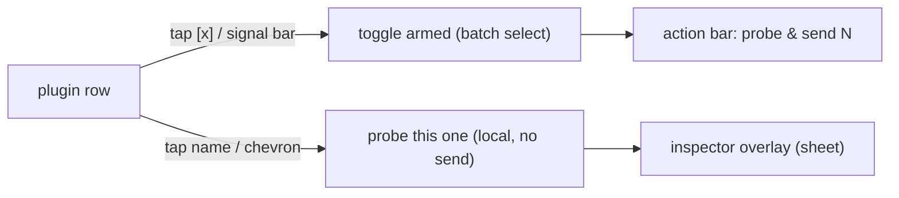

# auv3-probe — design

What this app is, why it exists, and how it is put together. It is the **iPad
node** of the [mcp-midi-controller](https://github.com/teemow/mcp-midi-controller)
rig ecosystem — the permanent presence on the iPad, alongside the orchestrator
(laptop), "threefoot" (the pedalboard footswitch), and rig-capture (macOS). Its
first job, parameter-tree probing, is the AUv3 analog of the main repo's
`widi-probe` / `usb-probe` spikes; the sections below document that job in
detail. See [Scope](#scope-the-ipad-node) for where it is heading.

> This is a public repo. Keep installation-specific data (real receiver
> hostnames/IPs, device names, rig inventory) out of committed code and docs —
> the receiver endpoint is entered at runtime and never persisted. See the
> "Public-repo rule" section of the README.

## Scope (the iPad node)

`auv3-probe` is the rig's foothold on the iPad. iOS and AUM are sandboxed: the
orchestrator on the laptop and the footswitch on the pedalboard cannot see the
installed plugins, cannot read AUM's session files, and cannot live inside the
audio host. This app can — so it owns everything that has to happen *on the
device*. Four jobs, in the order they are being built:

1. **Probe AUv3 plugins** (shipping today, the rest of this doc). Enumerate the
   installed Audio Units and dump each one's `AUParameterTree` as JSON.
2. **Read/write AUM projects.** Move `.aumproj` sessions on/off the device over
   the same LAN channel as the probe receiver, so the orchestrator's Go
   `internal/aum` library can read, diff, and author them. The contract mirrors
   the probe contract: the iPad does file I/O + transfer, the laptop owns the
   `NSKeyedArchiver` (de)serialization — the Go tools cannot touch a session
   without the iPad online to fetch/push the file.
3. **Run inside AUM.** Ship as an AUv3 extension so the app lives *in* the host
   process, not just beside it — the path toward a scriptable on-device surface.
4. **Assist "threefoot".** Help the pedalboard footswitch load scenes or songs.

## Purpose (job 1: the probe)

The probe answers one question for the main project: *are our AUv3 plugin
definitions correct, and do they cover the plugin's maximum controllable
functionality?*

It does this the only way iOS allows — by reading each plugin's
`AUParameterTree` directly. The output turns the "convention we invented"
parameter tables in the main repo (`docs/research/auv3-plugins.md`) into
**measured** tables: full parameter list, real ranges/units/`valueStrings`, and
writable/readable flags. Those feed the device-authoring tools
(`create_device_definition` / `add_control`) via the `import_auv3_probe` MCP
tool.

The full rationale — why the BLE-echo and USB-readback feedback paths are
structurally unavailable for AUM-hosted plugins, and why parameter-tree
enumeration is sufficient — lives in the main repo's
`docs/research/auv3-feedback.md` (this app is "option 1" there).

## Where it sits in the system

The rig is one orchestrator and three edge nodes, each owning a surface the
others cannot reach:

```
                  ┌───────────────────────────────────┐
                  │  mcp-midi-controller (laptop)      │
                  │  the orchestrator — design-time:   │
                  │  probe import, AUM session author, │
                  │  scene compile, rig desired-state  │
                  └───────────────────────────────────┘
                     ▲              ▲              ▲
        AUv3 + AUM   │   USB editor │   compiled  │
        over LAN     │   protocols  │   scenes    │
                     │              │             │
   ┌─────────────────┘   ┌──────────┘   ┌─────────┘
   │                     │              │
┌──┴───────────┐  ┌──────┴───────┐  ┌───┴──────────────┐
│ auv3-probe   │  │ rig-capture  │  │ threefoot        │
│ (iPad)       │  │ (macOS)      │  │ (ESP32 footsw.)  │
│ AUv3 + AUM   │  │ vendor-editor│  │ offline scene/   │
│ on-device    │  │ capture over │  │ song player on   │
│ surface      │  │ USB pedals   │  │ the pedalboard   │
└──────────────┘  └──────────────┘  └──────────────────┘
```

The probe data path (job 1) in detail:

```
┌─────────────────────────── iPad ───────────────────────────┐
│  auv3-probe (this app)                                      │
│    AVAudioUnitComponentManager.components(...)  ── discover  │
│    AVAudioUnit.instantiate(with:)               ── probe     │
│    parameterTree (walked for groups) + metadata ── read tree │
│                         │                                    │
│                         ▼  ProbeDump (JSON) + run report     │
└─────────────────────────┼───────────────────────────────────┘
                          │  POST /auv3-probe              (per plugin)
                          │  POST /auv3-probe/diagnostics  (run report)
                          │  GET  /healthz                 (connectivity test)
                          ▼
   auv3-probe receiver  (main repo; binds the LAN, default :7800)
                          │  writes <ProbeID>.json (one per plugin)
                          │  writes _diagnostics/<ts>.json (per run)
                          ▼
   import_auv3_probe MCP tool ──▶ device YAML authoring (main repo)
```

Two repos, deliberately independent. The **only** contract between them is the
JSON shape of `ProbeDump` (below). The daemon's own MCP endpoint is
loopback-only, so the iPad cannot reach it directly — hence the separate
LAN-binding `cmd/auv3-probe` receiver as the off-daemon ingest point.

When the receiver is unreachable, a **Save-to-Files** fallback exports the same
JSON for manual transfer, producing the same `<ProbeID>.json` filename the
receiver would have written.

## Data flow

1. **Discover** — `AudioUnitProber.discover()` enumerates installed Audio Units
   of type `aumu` (instruments), `aufx` (effects) and `aumf` (music effects),
   sorted by name. It captures each component's human manufacturer name, type
   label, and version alongside the FourCC codes.
2. **Probe** — for each selected unit, `AudioUnitProber.probe(_:)` instantiates
   a throwaway instance, then:
   - **walks the parameter tree** depth-first (not just `allParameters`) so each
     `AUParameter` records its parent `AUParameterGroup` displayName (`group`),
   - records the full flag bitfield plus the decoded flags useful for authoring
     (`displayLogarithmic`, `displayExponential`, `isHighResolution`,
     `isRampable`, `isMeta`),
   - **sanitizes non-finite values** — AU params often report `±Inf`/`NaN`
     min/max/value (unbounded gain, log-scaled freq); JSON and Go's
     `encoding/json` cannot carry those, so they are clamped to finite sentinels
     and the fact is recorded in `nonFinite`,
   - reads AU-level extras: `factoryPresets` (number + name) and
     `audioUnitShortName`.
   No audio engine, no rendering — the instance exists only to read the tree and
   metadata, then is discarded. A unit with **no parameter tree** yields a dump
   with zero parameters (valid diagnostic data) rather than an error.
3. **Send / save** — `ProbeSender` POSTs the encoded `ProbeDump` to
   `/auv3-probe` (with `/healthz` as a pre-flight connectivity check), or the
   dump is stashed for the Save-to-Files exporter.
4. **Report** — at the end of a run `ProbeModel` POSTs a `ProbeReport` to
   `/auv3-probe/diagnostics` recording **every** outcome — sent, empty, and the
   plugins that **failed to instantiate** (which never produce a dump) — plus
   non-identifying device context. So all diagnostics land on the receiver, not
   just in the app UI.

`ProbeModel` (`@MainActor ObservableObject`) drives the single-screen UI:
receiver host field (persisted across launches in `UserDefaults`), search/filter,
per-row probe/send status, multi-select, a run summary, and the export fallback.

### Inspect-before-send (tap-to-inspect)

Sending is a deliberate, batch action — but the user can review exactly what
*would* be sent for any single plugin, on the device, before any data leaves it.
Each plugin row has two distinct tap targets:

- **Arm** — tapping the `[x]`/`[ ]` checkbox or the left signal bar toggles the
  row's batch selection (used by the bottom **probe & send** action). Unchanged
  from the send-only workflow.
- **Inspect** — tapping the plugin **name/body** (or the row's `chevron`
  affordance) runs `ProbeModel.inspect(_:)`: it probes that **one** plugin
  locally via the same `AudioUnitProber.probe(_:)` path the batch send uses,
  stashes the dump, and opens the **inspector overlay**. No data is sent.



Because inspect reuses the exact probe path, **what you inspect equals what you
would send** — byte-identical. The dump is stashed too, so the per-row
Save-to-Files button works immediately after inspecting.

The **inspector overlay** (`ProbeInspectorView`, a signalwave-styled `.sheet`)
is a read-only "no obfuscation" view of a single `ProbeDump`:

- **Header** — `name` + `shortName`, the FourCC `type/subtype/manufacturer`,
  `manufacturerName`, and `version`.
- **Summary** — the at-a-glance "what gets sent": parameter count, writable
  count, non-finite (sanitized) count, factory/user preset counts, channel
  capabilities, latency/tail time, and whether user presets are supported.
- **Privacy note** — flags that `userPresets` names are installation-specific
  and only leave the device when sent to the user's own LAN receiver, consistent
  with the public-repo rule.
- **Parameters** — a `LazyVStack` sectioned by `group` (ungrouped params last),
  with an in-sheet filter. Each row shows displayName/keyPath, `min–max`, current
  `value`, `unit`(+`unitName`), `[w]`/`[r]` access badges, flag chips
  (`log`/`exp`/`hi-res`/`ramp`/`meta`/`deps:N`), a non-finite marker, and the raw
  `address`/`flags`. `valueStrings` stay collapsed behind a count
  (`indexed · N values`) and only render when tapped.
- **Presets** — factory and user lists (user clearly labelled on-device only).
- **Raw JSON** — a collapsible section rendering `try dump.encoded()` (the exact
  bytes that would be POSTed), encoded only when revealed.

Real dumps span 0 params up to thousands (one file is ~1.8 MB with very long
`valueStrings`), so the inspector renders lazily, keeps big `valueStrings`
collapsed, and defers raw-JSON encoding behind its disclosure to stay responsive
on the worst case.

## Source layout

| File | Role |
|------|------|
| `Sources/AUv3ProbeApp.swift` | `@main` SwiftUI `App` entry point. |
| `Sources/ContentView.swift` | Single-screen **signalwave** "sniffer console" (hand-built, not a system `Form`): wordmark header + rescan, receiver host + test, an inline plugin filter, a capture-style multi-select list with split arm/inspect tap targets, a fixed bottom action bar (Probe & Send + run summary), per-row Save-to-Files, and the inspector `.sheet`. |
| `Sources/ProbeInspectorView.swift` | The **tap-to-inspect** overlay: a read-only signalwave `.sheet` rendering one `ProbeDump` (header, summary, privacy note, group-sectioned lazy parameter list, presets, raw JSON) — the exact bytes a batch send would POST. |
| `Sources/Theme.swift` | The signalwave design system in SwiftUI: palette (`Signalwave.*`), monospaced fonts, the wave/probe `WaveGlyph`, primary/ghost button styles, field + section-header surfaces. |
| `Sources/ProbeModel.swift` | `ObservableObject` state + orchestration (discover, test, probe single/batch, send, inspect, export). |
| `Sources/AudioUnitProber.swift` | AUv3 enumeration + `AUParameterTree` → `ProbeDump` mapping; `FourCharCode` ↔ string; unit-enum rendering. |
| `Sources/ProbeSender.swift` | LAN client (`POST /auv3-probe`, `GET /healthz`) + `ProbeJSONDocument` for Save-to-Files. |
| `Sources/ProbeDump.swift` | The cross-repo JSON schema mirror (`ProbeDump` / `ProbeParam` / `ProbeComponent`) + `probeID` / `sanitizeID`. |
| `Resources/Info.plist` | Local-network usage string + ATS local-networking allowance; orientations (macOS/XcodeGen build). |
| `Resources/AUv3Probe.entitlements` | `inter-app-audio` — the gate for third-party AUv3 discovery (shared by both build paths). |
| `Makefile` | Single entry point for both build paths: `make build` (macOS/Xcode), `make deploy` / `xtool-build` / `devices` (Linux/xtool), `make help`. |
| `project.yml` | XcodeGen project definition for the macOS build (the `.xcodeproj` is generated, never committed). |
| `Package.swift` | SwiftPM manifest for the Linux/xtool build; its target `path: "Sources"` reuses the same sources as the XcodeGen build. |
| `xtool.yml` | xtool config (bundle id, info/entitlements/icon paths) for the Linux build. |
| `xtool-Info.plist` | xtool's `Info.plist` (the canonical `Resources/Info.plist` uses XcodeGen `$(...)` vars xtool can't resolve). |

## Key design decisions

- **Enumeration is instance-independent.** A plugin's parameter tree is a
  property of the component, not of a particular instance — any instance exposes
  the same tree AUM would host. So reading a throwaway instance fully answers the
  "correct + maximum functionality" question without needing AUM's live instance
  (which is sandboxed and unreachable anyway).
- **Inter-App Audio entitlement is mandatory.** Without `inter-app-audio`,
  `AVAudioUnitComponentManager` returns only Apple's in-process built-in Audio
  Units and **none** of the third-party AUv3s. The symptom and the lazy-registry
  fallback are documented in [auv3-discovery.md](auv3-discovery.md). It works
  with a free Apple ID.
- **The JSON keys are the contract.** `ProbeDump.swift` is a hand-pinned mirror
  of the Go `device.ProbeDump` / `ProbeParam` / `ProbeComponent` structs in the
  main repo (`internal/device/auv3probe.go`). Explicit `CodingKeys` and
  `.sortedKeys` output keep the wire shape deterministic. If the Go structs
  change, this mirror must change with them — the two repos share no code.
- **`keyPath` is recorded, not just `address`.** `address` can change if a
  plugin rearranges its tree; `keyPath` is the stable identifier, so a future
  re-probe can detect when a plugin update reshuffles its parameters.
- **The last receiver host is remembered, but never committed.** The
  `host[:port]` is persisted **on-device** in `UserDefaults` so it does not have
  to be retyped every launch. It is a local LAN address entered at runtime and
  is never written to git, so this still satisfies the public-repo rule (the rule
  is about committed artifacts, not on-device state).
- **All outcomes are reported, not just successes.** Probe failures, empty
  trees, and sanitized non-finite values are captured per run and POSTed to
  `/auv3-probe/diagnostics`, so the receiver — not just the app UI — has the full
  picture. Empty-parameter dumps are valid data and are staged, not rejected.
- **The live UI is the signalwave language, not system chrome.** The screen is
  hand-built rather than a stock `Form`/Liquid Glass surface so it can carry the
  full aesthetic (see `docs/signalwave.md`): a forced-dark deep-charcoal field, a
  single cyber-green signal accent, slate hairline dividers, monospaced lowercase
  chrome, and a capture-style plugin list. UI chrome is lowercased; raw data
  (plugin names, FourCC codes, parameter counts) is shown verbatim — "no
  obfuscation". The palette/fonts/components live in `Sources/Theme.swift`, built
  only from primitives available on the iOS 16 deployment floor (no iOS 26-only
  APIs), so no SDK gating is needed.
- **Inspect equals send; send stays a batch action.** Tapping a plugin name
  probes that one plugin through the *same* `AudioUnitProber.probe(_:)` path the
  batch send uses, so the inspector shows byte-identical data to what would be
  POSTed — "no obfuscation" holds literally, down to the raw JSON. The inspector
  is read-only review only; sending remains the explicit bottom **probe & send**
  action, so reviewing data never sends it by accident.
- **Open-loop by design.** Because AUM emits no parameter→MIDI feedback, live
  control of AUM-hosted plugins is open-loop; verification moves to *authoring
  time* (this probe), not every scene recall. This is a deliberate posture, not
  a gap — see the main repo's `docs/research/auv3-feedback.md`.

## Schema contract (`ProbeDump`)

One document per plugin. Keys are pinned to the Go structs consumed by
`import_auv3_probe`.

```json
{
  "component": {
    "type": "aumu", "subtype": "iSEM", "manufacturer": "Artu",
    "manufacturerName": "Arturia", "version": "1.2.0"
  },
  "name": "Arturia iSEM",
  "shortName": "iSEM",
  "factoryPresets": [{ "number": 0, "name": "Init" }],
  "parameters": [
    {
      "address": 0,
      "keyPath": "cutoff",
      "identifier": "cutoff",
      "displayName": "Cutoff",
      "min": 0.0, "max": 1.0,
      "value": 0.5,
      "unit": "generic", "unitName": null,
      "valueStrings": null,
      "writable": true, "readable": true,
      "group": "Filter",
      "flags": 13,
      "displayLogarithmic": true,
      "isHighResolution": true
    }
  ]
}
```

- `component.type/subtype/manufacturer` are `FourCharCode` (`OSType`) values
  rendered as 4-character strings (non-printable bytes → `?`).
- `component.manufacturerName` / `version`, `shortName`, `factoryPresets`, and
  the per-param `group` / `flags` / `displayLogarithmic` / `displayExponential`
  / `isHighResolution` / `isRampable` / `isMeta` / `nonFinite` fields are
  **optional richer metadata** (added 2026-06). They are omitted when empty and
  decode to the zero value on the Go side, so older dumps stay valid.
- `min` / `max` / `value` are **always finite**. AU non-finite values
  (`±Inf`/`NaN`) are clamped to finite sentinels before encoding and the fact is
  recorded in `nonFinite` (e.g. `"max=+inf"`); the Swift encoder also sets
  `.convertToString` as a defensive backstop.
- `unitName` / `valueStrings` are optional: the Go side decodes JSON `null` into
  the empty string / a nil slice respectively.
- The staged filename is `<ProbeID>.json`, where `ProbeID` is the sanitized
  component subtype (falling back to the name). `ProbeDump.probeID` /
  `sanitizeID` mirror `device.ProbeID` / `sanitizeName` so the Save-to-Files
  path matches the receiver's naming exactly.

### Diagnostics report (`ProbeReport`)

POSTed once per run to `/auv3-probe/diagnostics`; the receiver stores it as
`_diagnostics/<timestamp>.json`. Mirrors Go `device.ProbeReport`.

```json
{
  "app": "auv3-probe 1.0.0",
  "startedAt": "2026-06-03T14:38:00Z",
  "device": { "model": "iPad", "systemName": "iPadOS", "systemVersion": "26.0" },
  "results": [
    { "id": "isem", "name": "Arturia iSEM", "component": { "type": "aumu", "subtype": "iSEM", "manufacturer": "Artu" }, "status": "sent", "params": 40, "writable": 38 },
    { "id": "broken", "name": "Broken FX", "component": { "type": "aufx", "subtype": "brkn", "manufacturer": "xxxx" }, "status": "failed", "error": "could not instantiate audio unit: …" }
  ]
}
```

- `status` is `sent` | `probed` (no receiver host) | `empty` (no params) |
  `failed` (`error` explains why).
- `device` deliberately omits the user-assigned device name to keep the report
  free of personal/identifying detail.

## Build & distribution

The project is **generated** from `project.yml` with XcodeGen; the `.xcodeproj`
is gitignored.

- **macOS:** `make generate && make build` (or open the generated project in
  Xcode, set a personal team, and Run). A free 7-day provisioning profile is
  fine for local development.
- **Linux (no Mac):** `make deploy` builds/signs/installs via xtool, reusing the
  in-repo `Package.swift` + `xtool.yml` (which point at the same `Sources/`). The
  same `inter-app-audio` entitlement is declared via `xtool.yml`'s
  `entitlementsPath`. See [building-on-linux.md](building-on-linux.md).
- **CI:** `.github/workflows/ci.yaml` runs a build-only check
  (`xcodebuild ... CODE_SIGNING_ALLOWED=NO`) on a GitHub-hosted `macos-latest`
  runner — no personal machine in the loop.

## Non-goals / future

The probe (job 1) is deliberately narrow; the broader scope above is the
roadmap, not a claim about today's binary.

- **The probe is not a host.** Job 1 does not run plugins for audio, render, or
  read back AUM's live instance — it reads the static parameter tree only.
- **Job 2 (AUM projects):** the iPad is the file mover, not the parser. It does
  `.aumproj` file I/O + LAN transfer; the `NSKeyedArchiver` (de)serialization
  lives in the orchestrator's Go `internal/aum` library. See the main repo's
  `docs/research/aum-session.md`.
- **Job 3 (run inside AUM):** shipping as an AUv3 extension is the path toward a
  scriptable on-device host — the **north star** of a daemon-driven AUv3 host
  (we *are* the host, exposing set-by-address + read-back + enumerate over
  OSC/WebSocket) that would allow true bidirectional verify. Recorded as the
  long-term target in the main repo's `docs/research/auv3-feedback.md`
  (option 5).
- **Job 4 (assist "threefoot"):** the iPad helping the pedalboard footswitch
  load scenes/songs is a rig-integration goal, not yet designed here.

## Design language

The visual + UX identity (palette, typography, logo motif, UI vibes) is the
**signalwave** language — see [signalwave.md](signalwave.md).

## References

- Main repo design + research: `docs/design.md`, `docs/research/auv3-feedback.md`,
  `docs/research/auv3-plugins.md`, `docs/research/aum.md` in
  [mcp-midi-controller](https://github.com/teemow/mcp-midi-controller).
- Receiver + schema: `cmd/auv3-probe/main.go`,
  `internal/device/auv3probe.go` (the Go side of the JSON contract).
- Apple `AUParameterTree` —
  <https://developer.apple.com/documentation/audiotoolbox/auparametertree>.
