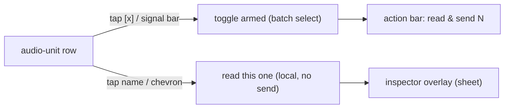

# auv3-probe — design

What this app is, why it exists, and how it is put together. It is the **iPad
node** of the [mcp-midi-controller](https://github.com/teemow/mcp-midi-controller)
rig ecosystem — the permanent presence on the iPad, alongside the orchestrator
(laptop), "threefoot" (the pedalboard footswitch), and rig-capture (macOS). It
reads the installed AUv3 audio units and ferries AUM sessions to/from the
orchestrator; the sections below document both jobs. See
[Scope](#scope-the-ipad-node) for where it is heading.

> This is a public repo. Keep installation-specific data (real daemon
> hostnames/IPs, device names, rig inventory) out of committed code and docs —
> the daemon host is entered at runtime and never committed. See the
> "Public-repo rule" section of the README.

## Scope (the iPad node)

`auv3-probe` is the rig's foothold on the iPad. iOS and AUM are sandboxed: the
orchestrator on the laptop and the footswitch on the pedalboard cannot see the
installed audio units, cannot read AUM's session files, and cannot live inside
the audio host. This app can — so it owns everything that has to happen *on the
device*. Four jobs, in the order they are being built:

1. **Read AUv3 audio units** (shipping). Enumerate the installed Audio Units and
   read each one's `AUParameterTree` (parameters + presets) into JSON.
2. **Read/write AUM sessions** (shipping). Move `.aumproj` / `.aum_midimap`
   files on/off the device over the same LAN channel, so the orchestrator's Go
   `internal/aum` library can read, diff, and author them. The iPad does file
   I/O + transfer; the laptop owns the `NSKeyedArchiver` (de)serialization — the
   Go tools cannot touch a session without the iPad online to fetch/push the
   file, and the app never re-encodes the bytes (it has no parser).
3. **Run inside AUM.** Ship as **two AUv3 app extensions** (ProbeMidiBrain, an
   `aumi` MIDI processor; ProbeAudioTap, an `aufx` audio tap) so the app lives
   *in* the host process, not just beside it — the path toward a scriptable
   on-device surface. See [auv3-extension.md](auv3-extension.md).
4. **Assist "threefoot".** Help the pedalboard footswitch load scenes or songs
   (ProbeMidiBrain's footswitch→scene mapping is the first step).

The throughline for jobs 3 + 4 is bigger than it first looks: hosted inside AUM,
`ProbeMidiBrain` can reach almost AUM's **entire** control surface over MIDI —
transport, tempo, mixer, **any node parameter**, and **session load** (measured
in [aum-control-surface.md](aum-control-surface.md)). The catch is that it only
reaches what the loaded session has **mapped**. So the brain's value as an AUM
controller depends entirely on (a) how well the orchestrator **understands AUM
sessions** and (b) whether every session carries a **standard MIDI-control
mapping** so the brain can change scenes deterministically. That vision lives in
the orchestrator repo:
[mcp-midi-controller / aum-brain-control.md](https://github.com/teemow/mcp-midi-controller/blob/main/docs/aum-brain-control.md).

The app is one shell (`RootView`) with a shared daemon-host bar over a `TabView`:
an **audio-units** tab (job 1) and an **AUM-sessions** tab (job 2). Both talk to
the same LAN daemon through one `DaemonClient`, pointed at one host held in the
shared `Receiver`.

## Purpose (job 1: reading audio units)

Reading an audio unit answers one question for the main project: *are our AUv3
device definitions correct, and do they cover the unit's maximum controllable
functionality?*

It does this the only way iOS allows — by reading each unit's `AUParameterTree`
directly. The output turns the "convention we invented" parameter tables in the
main repo (`docs/research/auv3-plugins.md`) into **measured** tables: full
parameter list, real ranges/units/`valueStrings`, and writable/readable flags.
Those feed the device-authoring tools (`create_device_definition` /
`add_control`) via the `import_auv3_probe` MCP tool.

The full rationale — why the BLE-echo and USB-readback feedback paths are
structurally unavailable for AUM-hosted units, and why parameter-tree
enumeration is sufficient — lives in the main repo's
`docs/research/auv3-feedback.md` (this app is "option 1" there).

## Where it sits in the system

The rig is one orchestrator and three edge nodes, each owning a surface the
others cannot reach:

```
                  ┌───────────────────────────────────┐
                  │  mcp-midi-controller (laptop)      │
                  │  the orchestrator — design-time:   │
                  │  audio-unit import, AUM session    │
                  │  author, scene compile, rig state  │
                  └───────────────────────────────────┘
                     ▲              ▲              ▲
        AUv3 + AUM   │   USB editor │   compiled  │
        over LAN     │   protocols  │   scenes    │
                     │              │             │
   ┌─────────────────┘   ┌──────────┘   ┌─────────┘
   │                     │              │
┌──┴───────────┐  ┌──────┴───────┐  ┌───┴──────────────┐
│ auv3-probe   │  │ rig-capture  │  │ threefoot        │
│ (iPad)       │  │ (macOS)      │  │ (ESP32 footsw.)  │
│ AUv3 + AUM   │  │ vendor-editor│  │ offline scene/   │
│ on-device    │  │ capture over │  │ song player on   │
│ surface      │  │ USB pedals   │  │ the pedalboard   │
└──────────────┘  └──────────────┘  └──────────────────┘
```

The audio-unit data path (job 1) in detail:

```
┌─────────────────────────── iPad ───────────────────────────┐
│  auv3-probe (this app)                                      │
│    AVAudioUnitComponentManager.components(...)  ── discover  │
│    AVAudioUnit.instantiate(with:)               ── read      │
│    parameterTree (walked for groups) + metadata ── read tree │
│                         │                                    │
│                         ▼  AudioUnitDetails (JSON) + report  │
└─────────────────────────┼───────────────────────────────────┘
                          │  POST /auv3-probe              (per unit)
                          │  POST /auv3-probe/diagnostics  (scan report)
                          │  GET  /healthz                 (connectivity test)
                          ▼
   auv3-probe receiver  (main repo; binds the LAN, default :7800)
                          │  writes <id>.json (one per unit)
                          │  writes _diagnostics/<ts>.json (per run)
                          ▼
   import_auv3_probe MCP tool ──▶ device YAML authoring (main repo)
```

The AUM-session data path (job 2):

```
┌─────────────────────────── iPad ───────────────────────────┐
│  auv3-probe (this app)                                      │
│    .fileImporter (AUM folder / Files) ── pick a .aumproj    │
│         │ raw bytes (verbatim, never re-encoded)            │
│         ▼                                                   │
└─────────┼───────────────────────────────────────────────────┘
          │  POST /aum-session              (upload bytes)
          │  GET  /aum-sessions             (manifest)
          │  GET  /aum-session/{id}         (download bytes)
          │  GET  /aum-session/{id}/map     (parsed AUMSessionMap, for inspect)
          ▼
   daemon receiver  ── internal/aum (de)serializes the NSKeyedArchiver plist
          │
          ▼
   .fileExporter ──▶ write the returned bytes back into AUM
```

Two repos, deliberately independent. The contracts between them are the JSON
shapes below (`AudioUnitDetails`, the AUM-session envelopes) plus the verbatim
session bytes. The daemon's own MCP endpoint is loopback-only, so the iPad
cannot reach it directly — hence the separate LAN-binding receiver as the
off-daemon ingest point.

When the daemon is unreachable for job 1, a **Save-to-Files** fallback exports
the same JSON for manual transfer, producing the same `<id>.json` filename the
receiver would have written.

## Data flow (job 1)

1. **Discover** — `AudioUnitScanner.discover()` enumerates installed Audio Units
   of type `aumu` (instruments), `aufx` (effects) and `aumf` (music effects),
   sorted by name. It captures each component's human manufacturer name, type
   label, and version alongside the FourCC codes.
2. **Read** — for each selected unit, `AudioUnitScanner.readDetails(_:)`
   instantiates a throwaway instance, then:
   - **walks the parameter tree** depth-first (not just `allParameters`) so each
     `AUParameter` records its parent `AUParameterGroup` displayName (`group`),
   - records the full flag bitfield plus the decoded flags useful for authoring
     (`displayLogarithmic`, `displayExponential`, `isHighResolution`,
     `isRampable`, `isMeta`),
   - **sanitizes non-finite values** — AU params often report `±Inf`/`NaN`
     min/max/value (unbounded gain, log-scaled freq); JSON and Go's
     `encoding/json` cannot carry those, so they are clamped to finite sentinels
     and the fact is recorded in `nonFinite`,
   - reads AU-level extras: `factoryPresets` (number + name) and
     `audioUnitShortName`.
   No audio engine, no rendering — the instance exists only to read the tree and
   metadata, then is discarded. A unit with **no parameter tree** yields an
   `AudioUnitDetails` with zero parameters (valid diagnostic data) rather than an
   error.
3. **Send / save** — `DaemonClient.sendAudioUnit(_:)` POSTs the encoded
   `AudioUnitDetails` to `/auv3-probe` (with `/healthz` as a pre-flight
   connectivity check), or the details are stashed for the Save-to-Files exporter.
4. **Report** — at the end of a run `AudioUnitsModel` POSTs a `ScanReport` to
   `/auv3-probe/diagnostics` recording **every** outcome — sent, empty, and the
   units that **failed to instantiate** (which never produce details) — plus
   non-identifying device context. So all diagnostics land on the receiver, not
   just in the app UI.

`AudioUnitsModel` (`@MainActor ObservableObject`) drives the audio-units tab:
search/filter, per-row read/send status, multi-select, a run summary, and the
export fallback. The daemon host lives in the shared `Receiver`, not the model.

### Inspect-before-send (tap-to-inspect)

Sending is a deliberate, batch action — but the user can review exactly what
*would* be sent for any single audio unit, on the device, before any data leaves
it. Each row has two distinct tap targets:

- **Arm** — tapping the `[x]`/`[ ]` checkbox or the left signal bar toggles the
  row's batch selection (used by the bottom **read & send** action).
- **Inspect** — tapping the unit **name/body** (or the row's `chevron`
  affordance) runs `AudioUnitsModel.inspect(_:)`: it reads that **one** unit
  locally via the same `AudioUnitScanner.readDetails(_:)` path the batch send
  uses, stashes the details, and opens the **inspector overlay**. No data is sent.



Because inspect reuses the exact read path, **what you inspect equals what you
would send** — byte-identical. The details are stashed too, so the per-row
Save-to-Files button works immediately after inspecting.

The **inspector overlay** (`AudioUnitInspectorView`, a signalwave-styled
`.sheet`) is a read-only "no obfuscation" view of one `AudioUnitDetails`:

- **Header** — `name` + `shortName`, then the human `typeName` ·
  `manufacturerName` · `version`, and `tags` as chips. (The raw FourCC
  `type/subtype/manufacturer` codes are not repeated in the header — they remain
  in the raw JSON.)
- **Summary** — one compact element: a wrapped line of totals (parameter /
  writable / non-finite counts, channel capabilities, latency/tail time,
  user-preset support) above a row of **tappable chips**. The chips are the
  per-`group` breakdown (`chorus (8)`, `echo (8)`…) plus the `factory` / `user`
  preset counts; tapping one **isolates** that group (or preset list) below.
- **Privacy note** — flags that `userPresets` names are installation-specific
  and only leave the device when sent to the user's own LAN daemon, consistent
  with the public-repo rule.
- **Parameters** — a `LazyVStack` sectioned by `group` (ungrouped params last),
  with an in-sheet text filter. Each row shows displayName/keyPath, `min–max`,
  current `value`, `unit`(+`unitName`), `[w]`/`[r]` access badges, flag chips
  (`log`/`exp`/`hi-res`/`ramp`/`meta`/`deps:N`), a non-finite marker, and the raw
  `address`/`flags`. `valueStrings` stay collapsed behind a count.
- **Presets** — factory and user lists (user clearly labelled on-device only).
- **Raw JSON** — a collapsible section rendering `try details.encoded()` (the
  exact bytes that would be POSTed), encoded only when revealed.

Real records span 0 params up to thousands (one is ~1.8 MB with very long
`valueStrings`), so the inspector renders lazily, keeps big `valueStrings`
collapsed, and defers raw-JSON encoding behind its disclosure to stay responsive.

## Data flow (job 2: AUM sessions)

The app stays a thin byte-ferry: it never parses the `.aumproj` /
`.aum_midimap` plist (a binary `NSKeyedArchiver` archive). All structured
understanding lives in the Go `internal/aum` library, reached over the LAN.

1. **Upload** — the user picks a `.aumproj` via `.fileImporter` (read under a
   security-scoped resource). `DaemonClient.uploadAUMSession(data:filename:)`
   POSTs the **verbatim bytes** (`application/octet-stream`, filename in
   `X-AUM-Filename`) to `/aum-session`; the daemon replies with an
   `AUMSessionSummary` (title, version, channel/node/mapped counts).
2. **List** — `DaemonClient.listAUMSessions()` (`GET /aum-sessions`) returns the
   manifest of files the daemon can return (`AUMSessionEntry`: filename, kind
   session/midimap, generated flag, size, modified time).
3. **Inspect** — tapping a manifest row fetches the parsed structure via
   `DaemonClient.fetchAUMSessionMap(id:)` (`GET /aum-session/{id}/map`) — an
   `AUMSessionMap` mirroring the Go `aum.SessionMap` (channels → nodes,
   assigned mappings) — rendered read-only by `AUMSessionInspectorView`.
4. **Download / write back** — `DaemonClient.downloadAUMSession(id:)`
   (`GET /aum-session/{id}`) returns the verbatim bytes plus the
   `Content-Disposition` filename; `.fileExporter` writes them back into AUM.

`AUMSessionsModel` (`@MainActor ObservableObject`) drives the AUM-sessions tab:
upload state, the fetched manifest, per-row download/export status, and the
inspect sheet. Verbatim is the whole point — uploads/downloads must not
re-encode, so the Go plist round-trip is the only transform a session ever sees.

## Source layout

`Sources/` is split into one directory per build target (SwiftPM / xtool require
this), shared by both build systems:

- **`Sources/ProbeKit/`** — shared library used by the app *and* the two AUv3
  extensions (job 3): the design system, LAN client, data contracts, and
  realtime AUv3 helpers.
- **`Sources/AUv3ProbeApp/`** — the container app (`@main`), jobs 1 + 2.
- **`Sources/ProbeMidiBrain/`** / **`Sources/ProbeAudioTap/`** — the two AUv3 app
  extensions. See [auv3-extension.md](auv3-extension.md).

| File | Role |
|------|------|
| **ProbeKit (shared)** | |
| `Sources/ProbeKit/Theme.swift` | The **signalwave** design system: palette (`Signalwave.*`), monospaced fonts, the `WaveGlyph`, button styles, field + section-header surfaces, and the shared `SignalChip` / `FlowChips` / `WrapLayout`. Public so the extensions' UIs reuse it. |
| `Sources/ProbeKit/Receiver.swift` | App connection state, driven by Bonjour discovery: exposes `isConfigured` and the `DaemonClient` factory for the discovered daemon. Injected as an `EnvironmentObject`. |
| `Sources/ProbeKit/DaemonDiscovery.swift` | Bonjour/mDNS discovery of `mcp-midi-controller` (`_mcpmidi._tcp`): resolves `host:port`, reads version/capabilities from the TXT record, polls `healthz`. The single host source for the app and both extensions. |
| `Sources/ProbeKit/DaemonStatusView.swift` | The one status element shared verbatim by all three surfaces (app + both AUv3 UIs): discovered IP, connection status, daemon capabilities, and version. |
| `Sources/ProbeKit/DaemonClient.swift` | The single LAN client to the daemon: audio-unit POSTs (`/auv3-probe`, `/auv3-probe/diagnostics`), AUM-session upload/list/download/map, `/healthz`, and `webSocketURL(path:)` (used by ProbeAudioTap); `DaemonError`. |
| `Sources/ProbeKit/AudioUnitDetails.swift` | The cross-repo JSON schema mirror (`AudioUnitDetails` / `AudioUnitComponent` / `ParameterInfo` / `PresetInfo`) + scan report types (`ScanReport` / `ScanResult` / `ScanDevice`) + `fileID` / `sanitizeID`. |
| `Sources/ProbeKit/AUMSessionModels.swift` | The cross-repo JSON mirror for the session endpoints (`AUMSessionSummary` / `AUMSessionEntry`) and the parsed map (`AUMSessionMap` / `ChannelInfo` / `NodeInfo` / `MappingInfo`). |
| `Sources/ProbeKit/FourCC.swift` | `FourCharCode` ↔ `String` helpers (shared by the scanner and the extensions' AudioComponent identity). |
| `Sources/ProbeKit/RealtimeRing.swift` | Lock-free single-producer/single-consumer `Float` ring buffer (swift-atomics) for the audio tap's render thread. |
| `Sources/ProbeKit/MIDISupport.swift` | Allocation-free MIDI 1.0 parse/encode helpers (`MidiMessage` / `MidiEncoder`) for the realtime path. |
| `Sources/ProbeKit/SongStructure.swift` | The brain's model + evaluator (`SongSection` / `FootswitchMapping` / `BrainProgram`). |
| **App entry (jobs 1+2)** | |
| `Sources/AUv3ProbeApp/AUv3ProbeApp.swift` | `@main` SwiftUI `App` entry point; shows `RootView`. |
| `Sources/AUv3ProbeApp/RootView.swift` | App shell: shared daemon-host bar + `TabView` (audio units \| AUM sessions); owns and injects the `Receiver`. |
| **Audio units (job 1)** | |
| `Sources/AUv3ProbeApp/AudioUnitScanner.swift` | AUv3 enumeration + `AUParameterTree` → `AudioUnitDetails` mapping (`discover()` / `readDetails(_:)`); `DiscoveredAudioUnit`; `AudioUnitError`. |
| `Sources/AUv3ProbeApp/AudioUnitsModel.swift` | `ObservableObject` state + orchestration (discover, auto-sync read+send of every unit once per discovered host, manual resync, inspect); `AudioUnitRowStatus`. |
| `Sources/AUv3ProbeApp/AudioUnitsView.swift` | The audio-units **signalwave** console: header + resync, inline filter, a capture-style list showing each unit's live sync state (no select/read step — units sync automatically on discovery), a bottom status bar (sync state + run summary), and the inspector `.sheet`. |
| `Sources/AUv3ProbeApp/AudioUnitInspectorView.swift` | The tap-to-inspect overlay rendering one `AudioUnitDetails` (header, summary, privacy note, group-sectioned lazy parameter list, presets, raw JSON). |
| **AUM sessions (job 2)** | |
| `Sources/AUv3ProbeApp/BinaryPlist.swift` / `AUMSessionParser.swift` | On-device read-only NSKeyedArchiver binary-plist decoder + the `.aumproj` → `AUMSessionMap` parser. |
| `Sources/AUv3ProbeApp/AUMFolderBookmark.swift` | Security-scoped bookmark for the linked AUM folder. |
| `Sources/AUv3ProbeApp/AUMSessionsModel.swift` | `ObservableObject` state (upload, manifest, download/export, inspect); `AUMSessionRowStatus`. |
| `Sources/AUv3ProbeApp/AUMSessionsView.swift` | The AUM-sessions **signalwave** ferry: upload `.aumproj`, manifest list with per-row inspect + download, and the inspector `.sheet`. |
| `Sources/AUv3ProbeApp/AUMSessionInspectorView.swift` | The inspector rendering one `AUMSessionMap` (header, summary, channel→node tree, mappings, raw JSON). |
| **AUv3 extensions (job 3)** | see [auv3-extension.md](auv3-extension.md) |
| `Sources/ProbeMidiBrain/` | `aumi` MIDI processor: `ProbeMidiBrainAU` (AU) + `BrainEngine` (realtime core) + `BrainController` (`/midi-control` WebSocket client) + `ControlSurface` (daemon-pushed `controlSurface` manifest, cached in `fullState`) + `ProbeMidiBrainViewController` (factory) + `ProbeMidiBrainView` (authoring UI + the rendered control surface). |
| `Sources/ProbeAudioTap/` | `aufx` audio tap: `ProbeAudioTapAU` (AU) + `TapDSP` (realtime core) + `TapStreamer` (WebSocket) + `ProbeAudioTapViewController` (factory) + `ProbeAudioTapView` (control UI). |
| **Build** | |
| `Resources/Info.plist` | Local-network usage string + ATS local-networking allowance; orientations (macOS/XcodeGen build). |
| `Resources/AUv3Probe.entitlements` | `inter-app-audio` — the gate for third-party AUv3 discovery (shared by both build paths). |
| `Makefile` | Single entry point for both build paths: `make build` (macOS/Xcode), `make deploy` / `xtool-build` / `devices` (Linux/xtool), `make help`. |
| `project.yml` | XcodeGen project definition for the macOS build: the `ProbeKit` framework, the app, and the two `app-extension` targets (their `NSExtension`/`AudioComponents` plists are generated from `info.properties`). The `.xcodeproj` is generated, never committed. |
| `Package.swift` | SwiftPM manifest for the Linux/xtool build: four targets (one dir each) + the swift-atomics dependency; reuses the same `Sources/`. |
| `xtool.yml` | xtool config: `product: AUv3ProbeApp` + an `extensions:` entry per AU. |
| `xtool-Info.plist` | xtool's app `Info.plist` (the canonical `Resources/Info.plist` uses XcodeGen `$(...)` vars xtool can't resolve). |
| `Extensions/*-Info.plist` | The literal extension `Info.plist`s (NSExtension/AudioComponents) used by the xtool path. |

## Key design decisions

- **Enumeration is instance-independent.** An audio unit's parameter tree is a
  property of the component, not of a particular instance — any instance exposes
  the same tree AUM would host. So reading a throwaway instance fully answers the
  "correct + maximum functionality" question without needing AUM's live instance
  (which is sandboxed and unreachable anyway).
- **Inter-App Audio entitlement is mandatory.** Without `inter-app-audio`,
  `AVAudioUnitComponentManager` returns only Apple's in-process built-in Audio
  Units and **none** of the third-party AUv3s. The symptom and the lazy-registry
  fallback are documented in [auv3-discovery.md](auv3-discovery.md). It works
  with a free Apple ID.
- **The JSON keys are the contract.** `AudioUnitDetails.swift` and
  `AUMSessionModels.swift` are hand-pinned mirrors of the Go structs in the main
  repo (`device.ProbeDump` / `ProbeParam` / `ProbeComponent` in
  `internal/device/auv3probe.go`; `aum.SessionMap` and friends in
  `internal/aum/session.go`). The Swift type names describe the concept; the JSON
  keys match the Go `json` tags. Explicit `CodingKeys` and `.sortedKeys` output
  keep the wire shape deterministic. If the Go structs change, these mirrors must
  change with them — the two repos share no code.
- **The app never parses an AUM session.** Job 2 moves verbatim bytes; all
  `.aumproj` structure comes from the daemon's `/map` endpoint. This keeps one
  copy of the format logic (the Go `internal/aum` library) and means the app
  cannot corrupt a file it does not model.
- **`keyPath` is recorded, not just `address`.** `address` can change if a unit
  rearranges its tree; `keyPath` is the stable identifier, so a future re-read
  can detect when an update reshuffles parameters.
- **The daemon is discovered, never typed.** Its `host:port` is found via
  Bonjour (`DaemonDiscovery`, service `_mcpmidi._tcp`) by the app and both AUv3
  extensions alike, so nothing is persisted and nothing LAN-specific is ever
  written to git — satisfying the public-repo rule by construction.
- **All outcomes are reported, not just successes.** Read failures, empty trees,
  and sanitized non-finite values are captured per run and POSTed to
  `/auv3-probe/diagnostics`, so the receiver — not just the app UI — has the full
  picture. Empty-parameter records are valid data and are staged, not rejected.
- **The live UI is the signalwave language, not system chrome.** The screens are
  hand-built rather than stock `Form`/Liquid Glass surfaces so they can carry the
  full aesthetic (see `docs/signalwave.md`): a forced-dark deep-charcoal field, a
  single cyber-green signal accent, slate hairline dividers, monospaced lowercase
  chrome. UI chrome is lowercased; raw data (unit names, FourCC codes, counts) is
  shown verbatim — "no obfuscation". Built only from primitives available on the
  iOS 16 deployment floor, so no SDK gating is needed.
- **Inspect equals send; send stays a batch action.** Tapping an audio unit's
  name reads that one unit through the *same* `AudioUnitScanner.readDetails(_:)`
  path the batch send uses, so the inspector shows byte-identical data to what
  would be POSTed. Sending remains the explicit bottom **read & send** action, so
  reviewing data never sends it by accident.
- **Open-loop by design.** Because AUM emits no parameter→MIDI feedback, live
  control of AUM-hosted units is open-loop; verification moves to *authoring
  time* (this read), not every scene recall. See the main repo's
  `docs/research/auv3-feedback.md`.

## Schema contract (`AudioUnitDetails`)

One document per audio unit. Keys are pinned to the Go structs consumed by
`import_auv3_probe` (the Go side names them `device.ProbeDump` /
`device.ProbeParam` / `device.ProbeComponent`).

```json
{
  "component": {
    "type": "aumu", "subtype": "iSEM", "manufacturer": "Artu",
    "manufacturerName": "Arturia", "version": "1.2.0",
    "typeName": "Instrument", "tags": ["Synthesizer", "Effects"]
  },
  "name": "Arturia iSEM",
  "shortName": "iSEM",
  "factoryPresets": [{ "number": 0, "name": "Init" }],
  "parameters": [
    {
      "address": 0,
      "keyPath": "cutoff",
      "identifier": "cutoff",
      "displayName": "Cutoff",
      "min": 0.0, "max": 1.0,
      "value": 0.5,
      "unit": "generic", "unitName": null,
      "valueStrings": null,
      "writable": true, "readable": true,
      "group": "Filter",
      "flags": 13,
      "displayLogarithmic": true,
      "isHighResolution": true
    }
  ]
}
```

- `component.type/subtype/manufacturer` are `FourCharCode` (`OSType`) values
  rendered as 4-character strings (non-printable bytes → `?`). Only `type` is a
  fixed Apple constant (`aumu` instrument / `aufx` effect / `aumf` music effect);
  `subtype` and `manufacturer` are vendor-chosen identifiers.
- `component.typeName` (human label, e.g. "Instrument") and `component.tags`
  (e.g. `["Distortion"]`, from `AVAudioUnitComponent.allTagNames`) are
  agent-facing categorization hints. App description / developer bio / changelog
  are **not** available — no iOS API exposes that to a third-party app.
- `component.manufacturerName` / `version` / `typeName` / `tags`, `shortName`,
  `factoryPresets`, and the per-param `group` / `flags` / `displayLogarithmic` /
  `displayExponential` / `isHighResolution` / `isRampable` / `isMeta` /
  `nonFinite` fields are **optional richer metadata**. They are omitted when
  empty and decode to the zero value on the Go side, so older records stay valid.
- `min` / `max` / `value` are **always finite**. AU non-finite values
  (`±Inf`/`NaN`) are clamped to finite sentinels before encoding and the fact is
  recorded in `nonFinite` (e.g. `"max=+inf"`); the Swift encoder also sets
  `.convertToString` as a defensive backstop.
- `unitName` / `valueStrings` are optional: the Go side decodes JSON `null` into
  the empty string / a nil slice respectively.
- The staged filename is `<id>.json`, where the id is the sanitized component
  subtype (falling back to the name). `AudioUnitDetails.fileID` / `sanitizeID`
  mirror the Go `device.ProbeID` / `sanitizeName` so the Save-to-Files path
  matches the receiver's naming exactly.

### Scan report (`ScanReport`)

POSTed once per run to `/auv3-probe/diagnostics`; the receiver stores it as
`_diagnostics/<timestamp>.json`. Mirrors Go `device.ProbeReport`.

```json
{
  "app": "auv3-probe 1.0.0",
  "startedAt": "2026-06-03T14:38:00Z",
  "device": { "model": "iPad", "systemName": "iPadOS", "systemVersion": "26.0" },
  "results": [
    { "id": "isem", "name": "Arturia iSEM", "component": { "type": "aumu", "subtype": "iSEM", "manufacturer": "Artu" }, "status": "sent", "params": 40, "writable": 38 },
    { "id": "broken", "name": "Broken FX", "component": { "type": "aufx", "subtype": "brkn", "manufacturer": "xxxx" }, "status": "failed", "error": "could not instantiate audio unit: …" }
  ]
}
```

- `status` is `sent` | `probed` (no daemon host) | `empty` (no params) |
  `failed` (`error` explains why). The `probed` token is the daemon's wire value
  for "read locally but not sent".
- `device` deliberately omits the user-assigned device name to keep the report
  free of personal/identifying detail.

## AUM-session contract

The session endpoints are defined by the daemon (main repo,
`internal/auv3receiver`). The app mirrors their JSON in `AUMSessionModels.swift`:

- `POST /aum-session` → `AUMSessionSummary` `{id, title, version, channels,
  nodes, mapped}`.
- `GET /aum-sessions` → `[AUMSessionEntry]` `{id, filename, kind, generated,
  bytes, modified}`.
- `GET /aum-session/{id}` → the verbatim file bytes (with `Content-Disposition`).
- `GET /aum-session/{id}/map` → `AUMSessionMap` (mirrors Go `aum.SessionMap`:
  `{version, tempo, channels[], mappings[]}`, channels carrying `nodes[]`).

## Build & distribution

The project is **generated** from `project.yml` with XcodeGen; the `.xcodeproj`
is gitignored.

- **macOS:** `make generate && make build` (or open the generated project in
  Xcode, set a personal team, and Run). A free 7-day provisioning profile is
  fine for local development.
- **Linux (no Mac):** `make deploy` builds/signs/installs via xtool, reusing the
  in-repo `Package.swift` + `xtool.yml` (which point at the same `Sources/`). The
  same `inter-app-audio` entitlement is declared via `xtool.yml`'s
  `entitlementsPath`. See [building-on-linux.md](building-on-linux.md).
- **CI:** `.github/workflows/ci.yaml` runs a build-only check
  (`xcodebuild ... CODE_SIGNING_ALLOWED=NO`) on a GitHub-hosted `macos-latest`
  runner — no personal machine in the loop.

## Non-goals / future

- **Job 1 is not a host.** It does not run units for audio, render, or read back
  AUM's live instance — it reads the static parameter tree only.
- **Job 2 is a file mover, not a parser.** The iPad does `.aumproj` file I/O +
  LAN transfer; the `NSKeyedArchiver` (de)serialization lives in the
  orchestrator's Go `internal/aum` library. See the main repo's
  `docs/research/aum-session.md`.
- **Job 3 (run inside AUM):** shipping as **two AUv3 app extensions**
  (ProbeMidiBrain + ProbeAudioTap) is the path toward a scriptable on-device host
  — the **north star** of a daemon-driven AUv3 host (we *are* the host, exposing
  set-by-address + read-back + enumerate over OSC/WebSocket) that would allow true
  bidirectional verify. The audio tap's PCM/feature stream is the first "ears"
  feedback loop. Architecture, AUM routing recipes, the realtime-safety model, and
  the audio-stream wire contract are in [auv3-extension.md](auv3-extension.md);
  recorded in the main repo's `docs/research/auv3-feedback.md` (option 5).
- **Job 4 (assist "threefoot"):** the iPad helping the pedalboard footswitch
  load scenes/songs is a rig-integration goal, not yet designed here.

## Design language

The visual + UX identity (palette, typography, logo motif, UI vibes) is the
**signalwave** language — see [signalwave.md](signalwave.md).

## References

- Main repo design + research: `docs/design.md`, `docs/research/auv3-feedback.md`,
  `docs/research/auv3-plugins.md`, `docs/research/aum.md`,
  `docs/research/aum-session.md` in
  [mcp-midi-controller](https://github.com/teemow/mcp-midi-controller).
- Receiver + schema: `cmd/auv3-probe/main.go`,
  `internal/device/auv3probe.go`, `internal/aum/session.go`,
  `internal/auv3receiver` (the Go side of the JSON contracts).
- Apple `AUParameterTree` —
  <https://developer.apple.com/documentation/audiotoolbox/auparametertree>.
```

